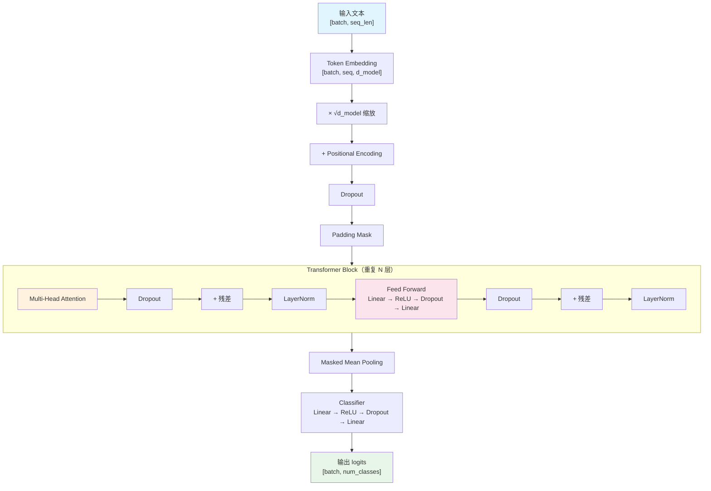
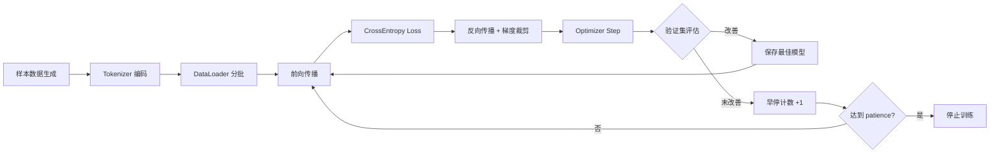
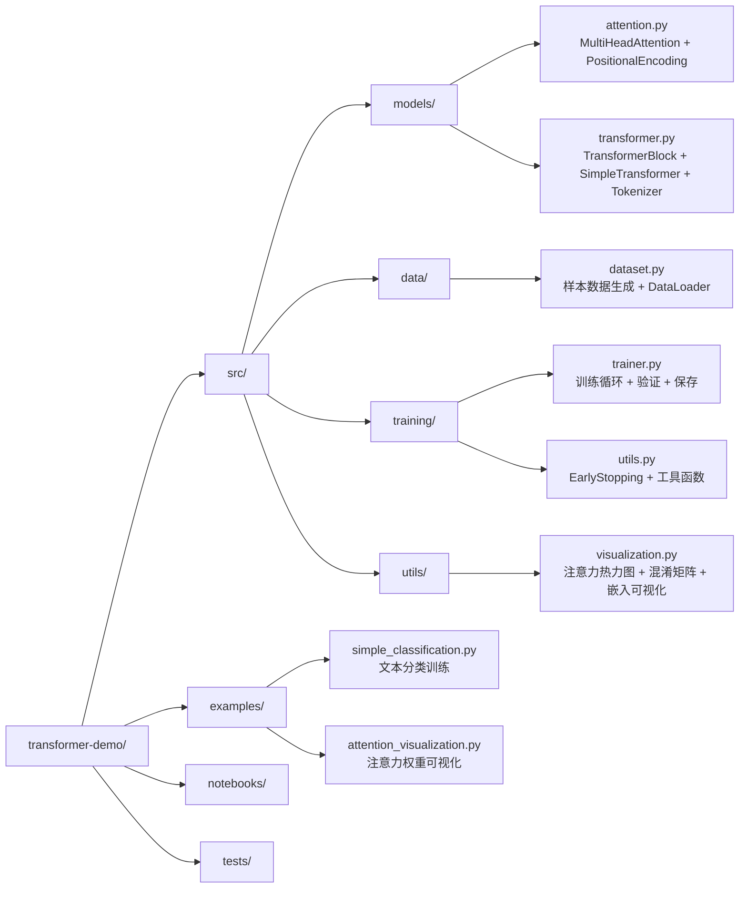
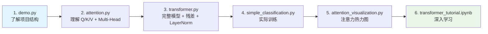

<p align="center">
  <h1 align="center">🚀 Transformer Demo</h1>
  <p align="center">
    <strong>从零实现 Transformer 模型 — PyTorch + uv</strong>
  </p>
  <p align="center">
    
    
    
    
    
  </p>
</p>

---

## 🎯 一句话

**不调库，从零写每一行 — Multi-Head Attention、Positional Encoding、FFN、残差连接、LayerNorm，全手写。**

## 🧠 为什么做这个项目

市面上的 Transformer 教程要么太抽象（只讲公式），要么太黑盒（直接调 `nn.TransformerEncoder`）。

这个项目把每一层拆开给你看：
- Q/K/V 矩阵怎么算的 → `attention.py`
- 位置编码怎么加的 → `attention.py`
- 残差连接 + LayerNorm 在哪 → `transformer.py`
- 训练循环怎么写 → `trainer.py`
- 注意力权重长什么样 → `attention_visualization.py`

## 🏗️ 架构

### 模型架构



### 训练流程



### 项目结构



## 📁 目录结构

```
transformer-demo/
├── src/
│   ├── models/
│   │   ├── attention.py        # MultiHeadAttention + PositionalEncoding
│   │   └── transformer.py      # TransformerBlock + SimpleTransformer + Tokenizer
│   ├── data/
│   │   └── dataset.py          # 样本数据生成 + DataLoader
│   ├── training/
│   │   ├── trainer.py          # 训练循环 + 验证 + checkpoint
│   │   └── utils.py            # EarlyStopping + set_seed + 工具函数
│   └── utils/
│       └── visualization.py    # 注意力热力图 + 混淆矩阵 + 嵌入可视化
├── examples/
│   ├── simple_classification.py     # 文本分类训练示例
│   └── attention_visualization.py   # 注意力权重可视化
├── notebooks/
│   └── transformer_tutorial.ipynb   # 交互式教程
├── tests/
│   └── test_models.py               # 单元测试
├── demo.py                          # 快速演示入口
├── pyproject.toml                   # 项目配置（uv）
└── README.md
```

## 🚀 快速开始

### 1. 安装依赖

```bash
# 安装 uv（推荐）
curl -LsSf https://astral.sh/uv/install.sh | sh

# 同步依赖
uv sync

# 安装 PyTorch（按你的系统选）
source .venv/bin/activate
pip install torch torchvision torchaudio
```

### 2. 运行

```bash
# 快速演示
python demo.py

# 训练文本分类
python examples/simple_classification.py

# 可视化注意力
python examples/attention_visualization.py

# 交互式教程
jupyter lab notebooks/transformer_tutorial.ipynb
```

## 📊 模型参数

| 参数 | 默认值 | 说明 |
|------|--------|------|
| `d_model` | 128 | 模型维度 |
| `num_heads` | 8 | 注意力头数 |
| `num_layers` | 6 | Transformer 层数 |
| `d_ff` | 512 | 前馈网络隐藏层维度 |
| `max_len` | 512 | 最大序列长度 |
| `num_classes` | 2 | 分类类别数 |
| `dropout` | 0.1 | Dropout 概率 |

## 📚 学习路径



## ✨ 特性

- 🔧 **从零实现** — 不调 `nn.TransformerEncoder`，每一层手写
- 📊 **完整训练流程** — 前向 + 反向 + 梯度裁剪 + 早停 + checkpoint
- 📈 **可视化** — 注意力热力图、多头对比、混淆矩阵、嵌入降维
- 🎯 **文本分类示例** — 情感分析（正面/负面）
- 📚 **详细注释** — 每行关键代码都有中文注释
- 🧪 **单元测试** — 模型维度、注意力输出形状验证

## 📄 License

MIT © [mg1094](https://github.com/mg1094)
